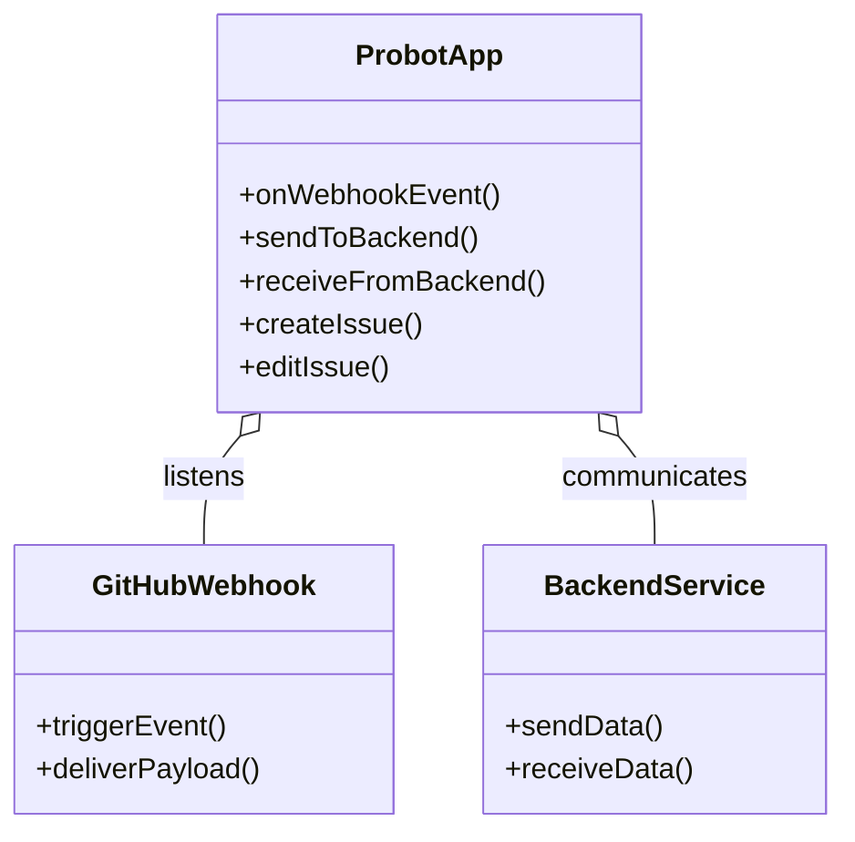

```mermaid
classDiagram
    class ProbotApp {
        +onWebhookEvent()
        +sendToBackend()
        +receiveFromBackend()
        +createIssue()
        +editIssue()
    }

    class GitHubWebhook {
        +triggerEvent()
        +deliverPayload()
    }

    class BackendService {
        +sendData()
        +receiveData()
    }

    ProbotApp o-- GitHubWebhook : listens
    ProbotApp o-- BackendService : communicates
```