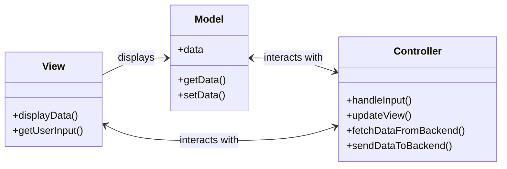

```mermaid
classDiagram
    direction LR
    class Model {
        +data
        +getData()
        +setData()
    }
    
    class View {
        +displayData()
        +getUserInput()
    }
    
    class Controller {
        +handleInput()
        +updateView()
        +fetchDataFromBackend()
        +sendDataToBackend()
    }

    
    Model <--> Controller : interacts with
    View <--> Controller : interacts with
    View --> Model : displays
```