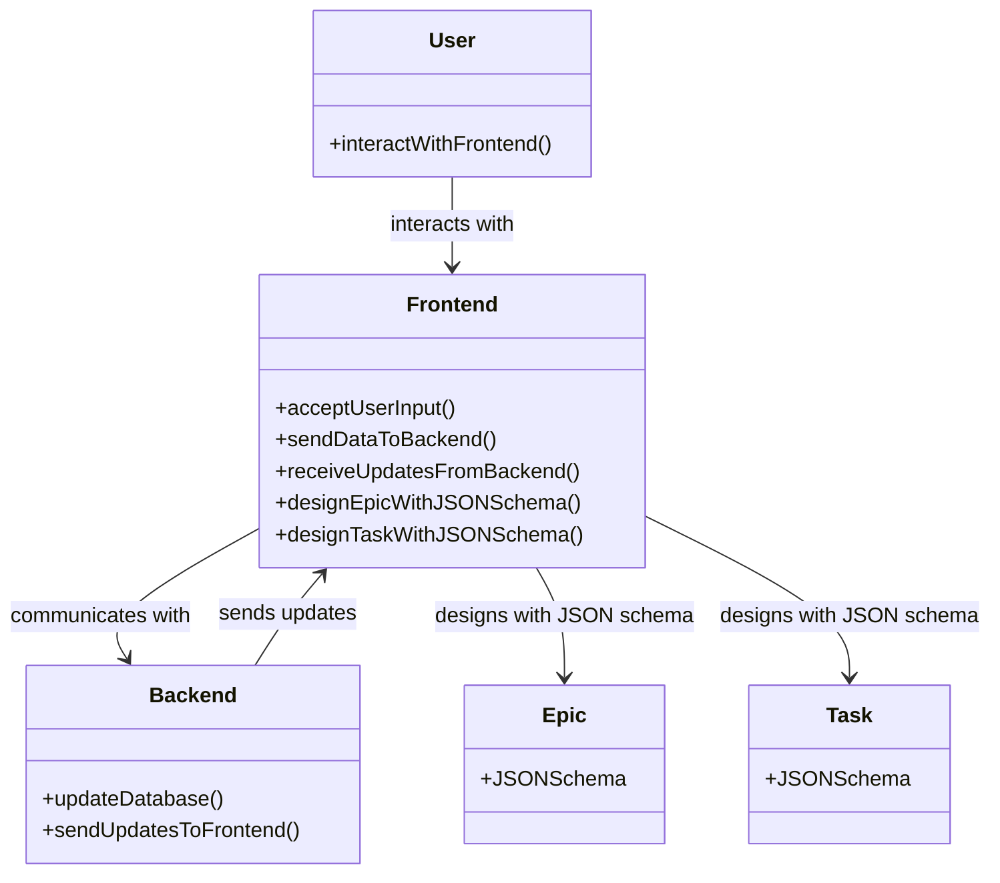

```mermaid
classDiagram
    class Frontend {
        +acceptUserInput()
        +sendDataToBackend()
        +receiveUpdatesFromBackend()
        +designEpicWithJSONSchema()
        +designTaskWithJSONSchema()
    }
    
    class Backend {
        +updateDatabase()
        +sendUpdatesToFrontend()
    }
    
    class User {
        +interactWithFrontend()
    }
    
    class Epic {
        +JSONSchema
    }
    
    class Task {
        +JSONSchema
    }
    
    User --> Frontend : interacts with
    Frontend --> Backend : communicates with
    Frontend --> Epic : designs with JSON schema
    Frontend --> Task : designs with JSON schema
    Backend --> Frontend : sends updates
```