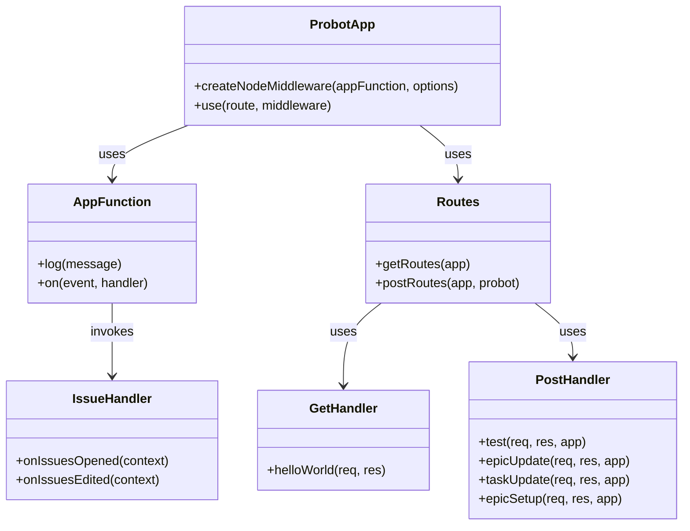

```mermaid
classDiagram
    class ProbotApp {
        +createNodeMiddleware(appFunction, options)
        +use(route, middleware)
    }

    class AppFunction {
        +log(message)
        +on(event, handler)
    }

    class IssueHandler {
        +onIssuesOpened(context)
        +onIssuesEdited(context)
    }

    class Routes {
        +getRoutes(app)
        +postRoutes(app, probot)
    }

    class GetHandler {
        +helloWorld(req, res)
    }

    class PostHandler {
        +test(req, res, app)
        +epicUpdate(req, res, app)
        +taskUpdate(req, res, app)
        +epicSetup(req, res, app)
    }

    ProbotApp --> AppFunction : uses
    AppFunction --> IssueHandler : invokes
    ProbotApp --> Routes : uses
    Routes --> GetHandler : uses
    Routes --> PostHandler : uses
```