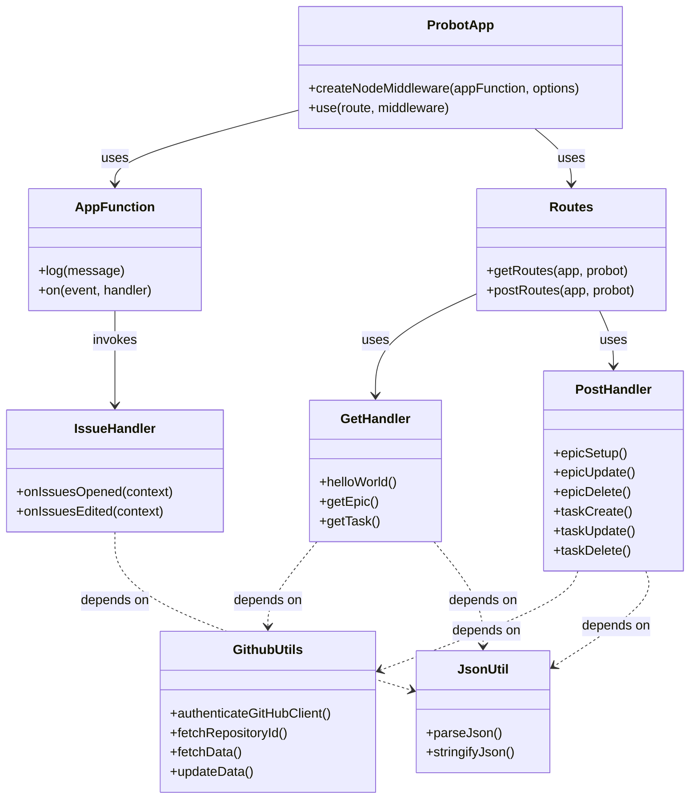

```mermaid
classDiagram
    class ProbotApp {
        +createNodeMiddleware(appFunction, options)
        +use(route, middleware)
    }

    class AppFunction {
        +log(message)
        +on(event, handler)
    }

    class IssueHandler {
        +onIssuesOpened(context)
        +onIssuesEdited(context)
    }

    class Routes {
        +getRoutes(app, probot)
        +postRoutes(app, probot)
    }

    class GetHandler {
        +helloWorld()
        +getEpic()
        +getTask()
    }

    class PostHandler {
        +epicSetup()
        +epicUpdate()
        +epicDelete()
        +taskCreate()
        +taskUpdate()
        +taskDelete()
    }

    class GithubUtils {
        +authenticateGitHubClient()
        +fetchRepositoryId()
        +fetchData()
        +updateData()
    }

    class JsonUtil {
        +parseJson()
        +stringifyJson()
    }

    ProbotApp --> AppFunction : uses
    AppFunction --> IssueHandler : invokes
    ProbotApp --> Routes : uses
    Routes --> GetHandler : uses
    Routes --> PostHandler : uses
    GetHandler ..> GithubUtils : depends on
    PostHandler ..> GithubUtils : depends on
    GetHandler ..> JsonUtil : depends on
    PostHandler ..> JsonUtil : depends on
    IssueHandler ..> JsonUtil : depends on

```