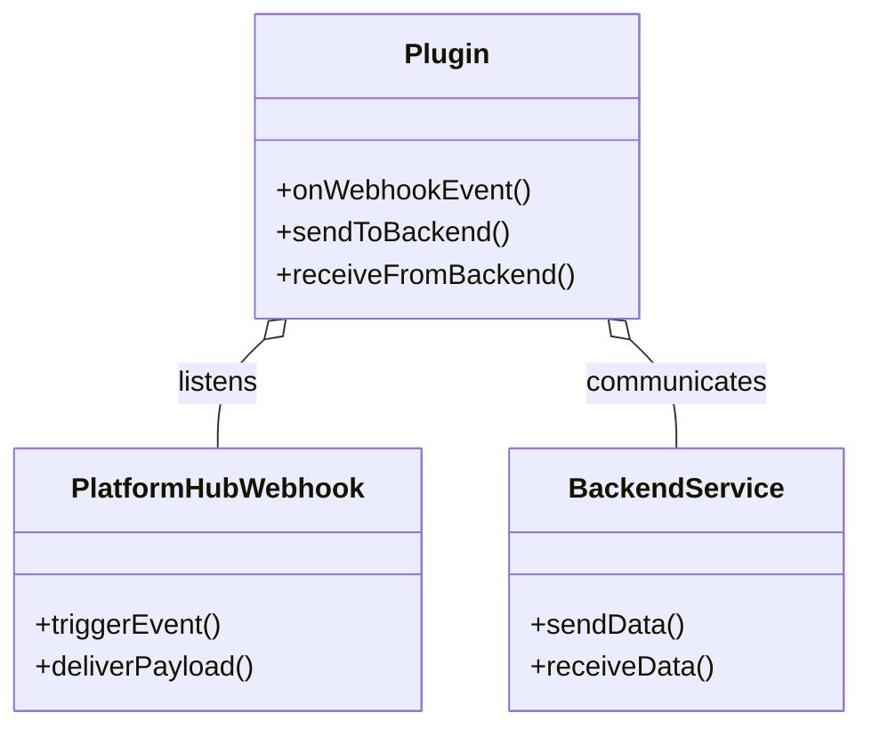

```mermaid
classDiagram
    class Plugin {
        +onWebhookEvent()
        +sendToBackend()
        +receiveFromBackend()
    }

    class PlatformHubWebhook {
        +triggerEvent()
        +deliverPayload()
    }

    class BackendService {
        +sendData()
        +receiveData()
    }

    Plugin o-- PlatformHubWebhook : listens
    Plugin o-- BackendService : communicates
```