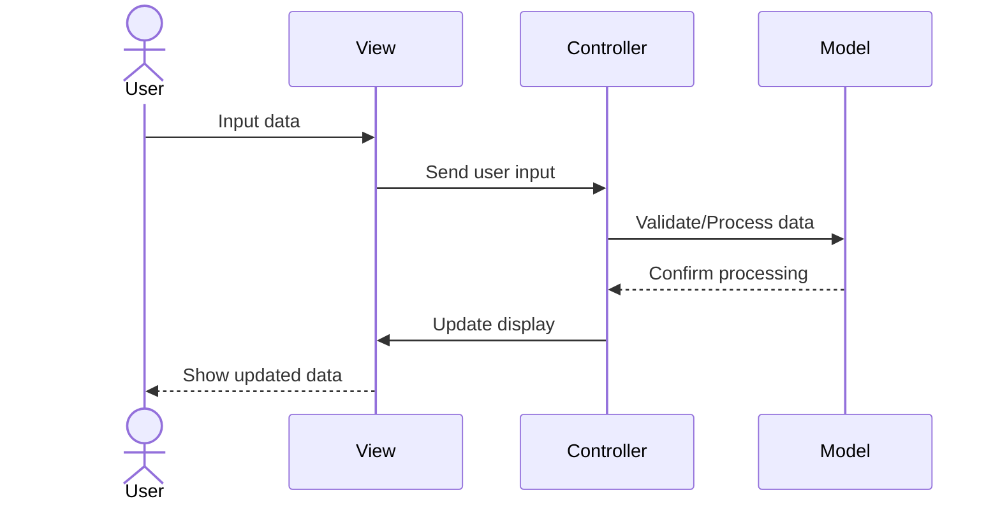

```mermaid
sequenceDiagram
    actor User
    participant View
    participant Controller
    participant Model

    User->>View: Input data
    View->>Controller: Send user input
    Controller->>Model: Validate/Process data
    Model-->>Controller: Confirm processing
    Controller->>View: Update display
    View-->>User: Show updated data

```