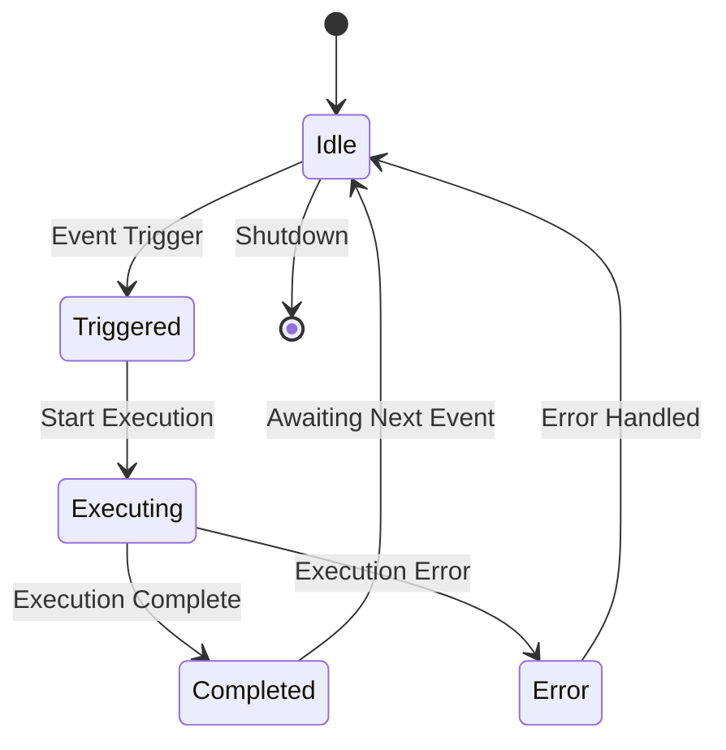

```mermaid
stateDiagram-v2
    [*] --> Idle
    Idle --> Triggered : Event Trigger
    Triggered --> Executing : Start Execution
    Executing --> Completed : Execution Complete
    Executing --> Error : Execution Error
    Completed --> Idle : Awaiting Next Event
    Error --> Idle : Error Handled
    Idle --> [*] : Shutdown

```