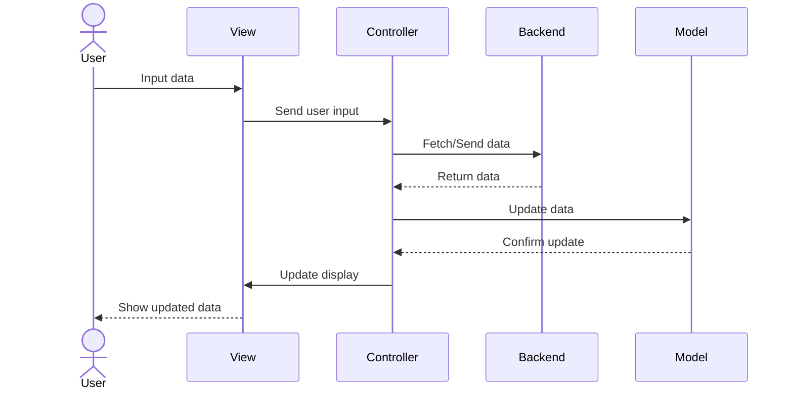

```mermaid
sequenceDiagram
    actor User
    participant View
    participant Controller
    participant Backend

    User->>View: Input data
    View->>Controller: Send user input
    Controller->>Backend: Fetch/Send data
    Backend-->>Controller: Return data
    Controller->>Model: Update data
    Model-->>Controller: Confirm update
    Controller->>View: Update display
    View-->>User: Show updated data

```